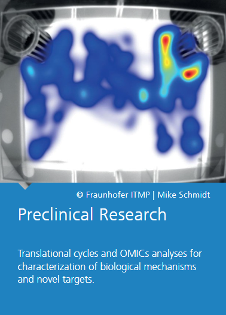
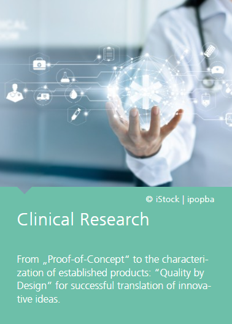

# Welcome to Fraunhofer ITMP Hamburg!  
This is the official GitHub organization section representing the **Hamburg site of the Fraunhofer Institute for Translational Medicine and Pharmacology (ITMP)**.

The Hamburg site is a leading research hub specializing in **small-molecule drug discovery, high-throughput screening, and medical data science**. We combine cutting-edge laboratory techniques with advanced computational analysis to innovate diagnostics and therapies, especially for immune-mediated, neurodegenerative, and infectious diseases.

## About Us

- **Mission:** Advancing health through innovative solutions by integrating drugs, devices, diagnostics, and data (“Health Research in 4D”).
- **Expertise:**  
  - High-throughput screening systems and diverse compound libraries  
  - Complex in vitro test systems using pluripotent stem cells and organoids, including blood-brain barrier models  
  - Advanced medical data science infrastructure featuring the Fraunhofer Edge Cloud, knowledge graphs, machine learning, and FAIR data principles  
  - Agile interdisciplinary teams in Stem Cell Biology, High-Throughput Screening, Infection Biology, and Medical Data Science  
- **Collaborations:** Strong partnerships with [University Medical Center Hamburg-Eppendorf](https://www.uke.de/index.html) (renal and neuroimmunology research), [Bernhard Nocht Institute for Tropical Medicine](https://www.bnitm.de/en) (structural virology), [DESY](https://desy.de/index_ger.html) (protein structure elucidation), and involvement in [EU-OPENSCREEN](https://www.eu-openscreen.eu/) and EU research projects for drug repurposing, and many more.

As an active member of the open-science and [FAIR](https://www.go-fair.org/fair-principles/) data communities, we vouch to align our projects with these principles to foster transparency and reproducibility.

## Our Areas of Innovation
Fraunhofer ITMP is organized in 9 cross-site and cross-divisional innovation areas, which provide a transdisciplinary and flexible approach to research using new technologies, disease and treatment concepts. The agile teams span the research divisions Drug Discovery, Preclinical and Clinical Research, where new disease related research concepts developed and examined. Please find more [here](https://www.itmp.fraunhofer.de/en/innovation-areas.html).

## Our Research Divisions
Fraunhofer ITMP is organized in 3 cross-site research divisions.

  

    <a href="https://www.itmp.fraunhofer.de/en/institute/DrugDiscovery.html" target="_blank" rel="noopener noreferrer">
       
    </a>
  

    <a href="https://www.itmp.fraunhofer.de/en/institute/PraeklinischeForschung.html" target="_blank" rel="noopener noreferrer">
       
    </a>
  

    <a href="https://www.itmp.fraunhofer.de/en/institute/KlinischeForschung.html" target="_blank" rel="noopener noreferrer">
       
    </a>
  

### Data Science Toolkit: All Our Tools in One Place
A collective front-face and an interactive playground of our repositories can be found [here](https://fraunhofer-itmp-ds-toolkit.serve.scilifelab.se/).

  <a href="https://fraunhofer-itmp-ds-toolkit.serve.scilifelab.se/" target="_blank" rel="noopener noreferrer">
     
  </a>

## Collaboration & Community

We encourage open, international collaboration with academia, industry, and healthcare partners to translate research into better patient outcomes.

> Visit our [official website](https://www.itmp.fraunhofer.de/en/institute/locations/hamburg.html) for more information on the Hamburg site.

Join us as we innovate for a healthier tomorrow!

## Contact Us

**Fraunhofer Institute for Translational Medicine and Pharmacology ITMP**  
Discovery Research ScreeningPort, VolksparkLabs  
Schnackenburgallee 114  
22525 Hamburg, Germany  

Phone: +49 40 303764-0  
Fax: +49 40 303764-100  

[Visit our website](https://www.itmp.fraunhofer.de/en/institute/locations/hamburg.html)